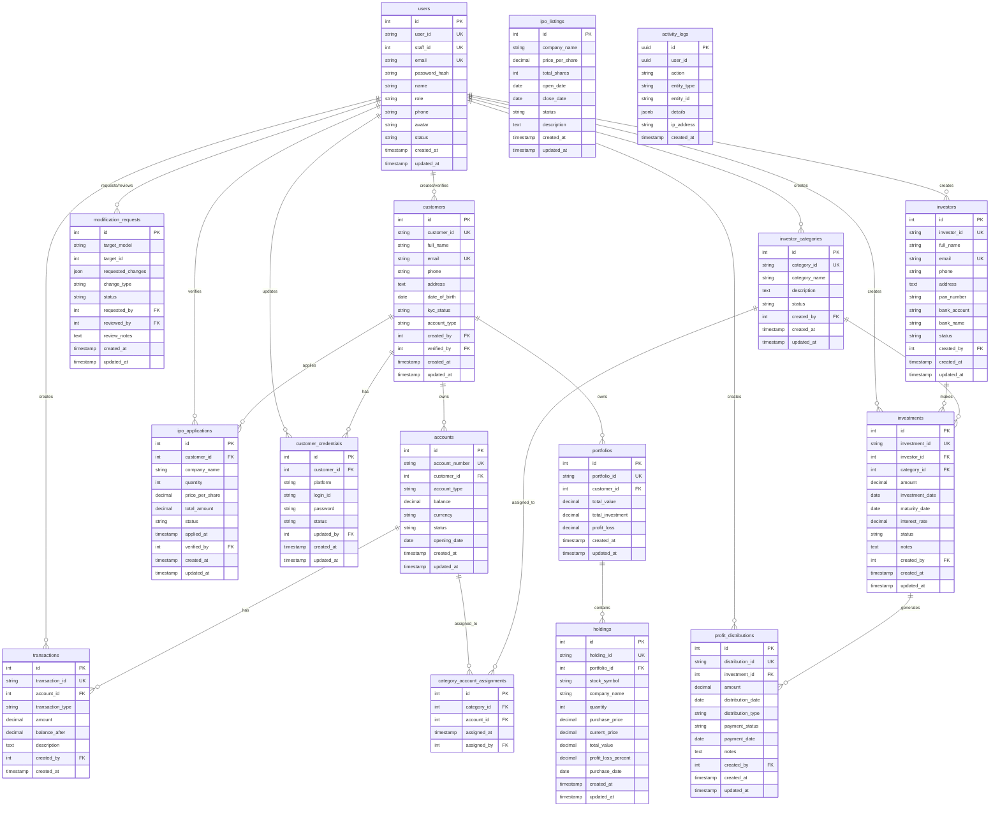
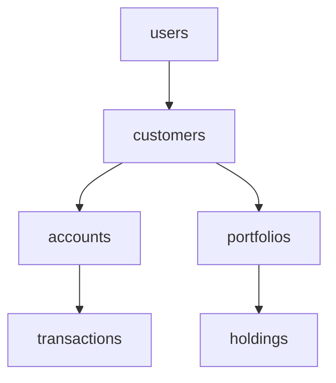
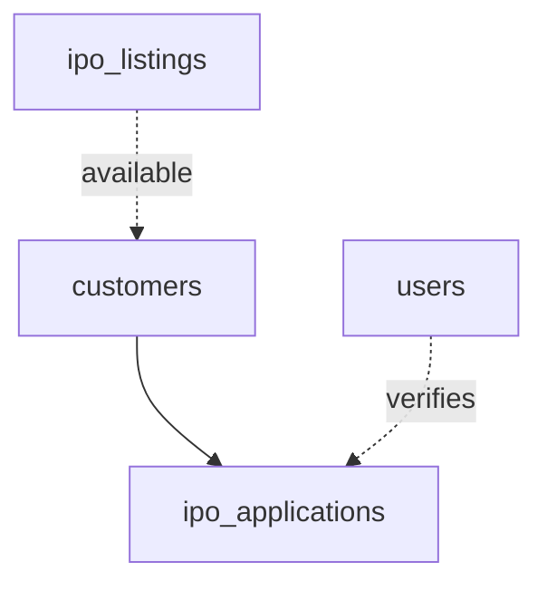
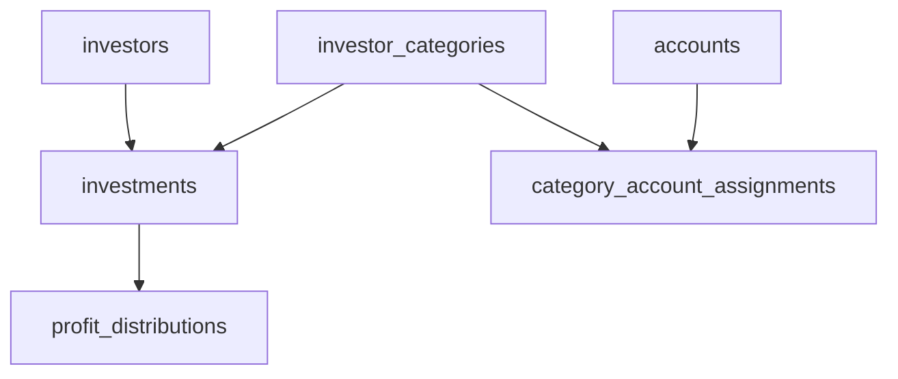
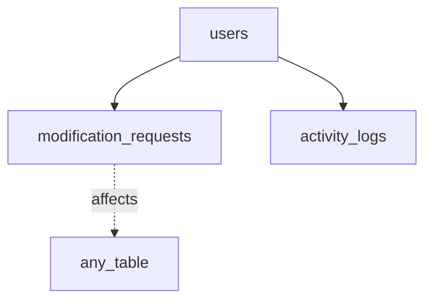
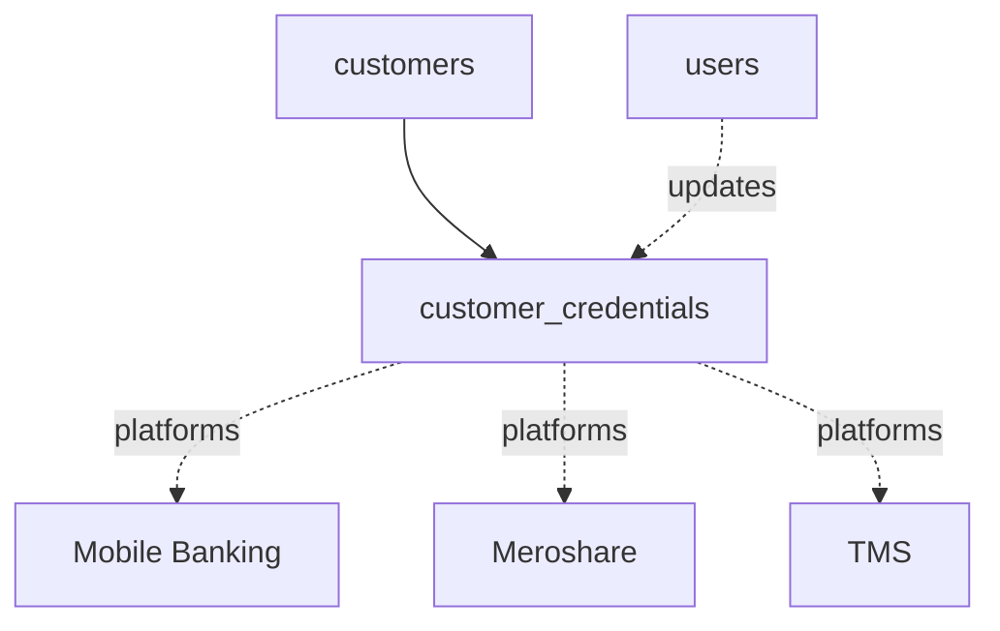
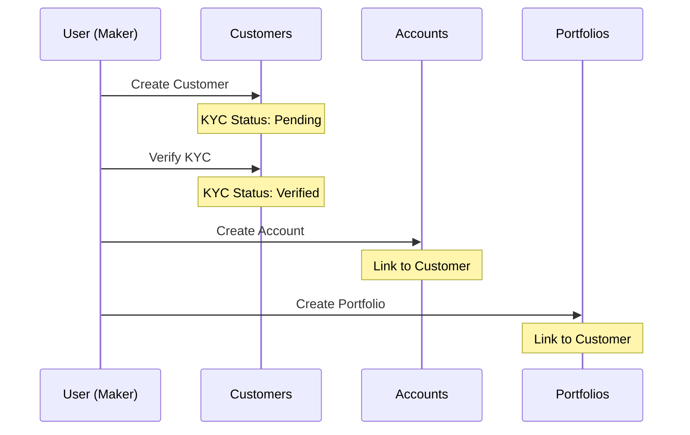
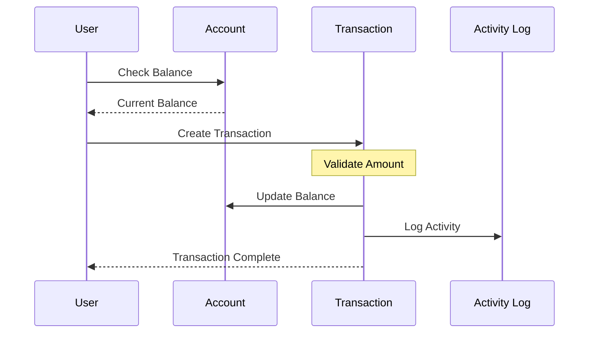
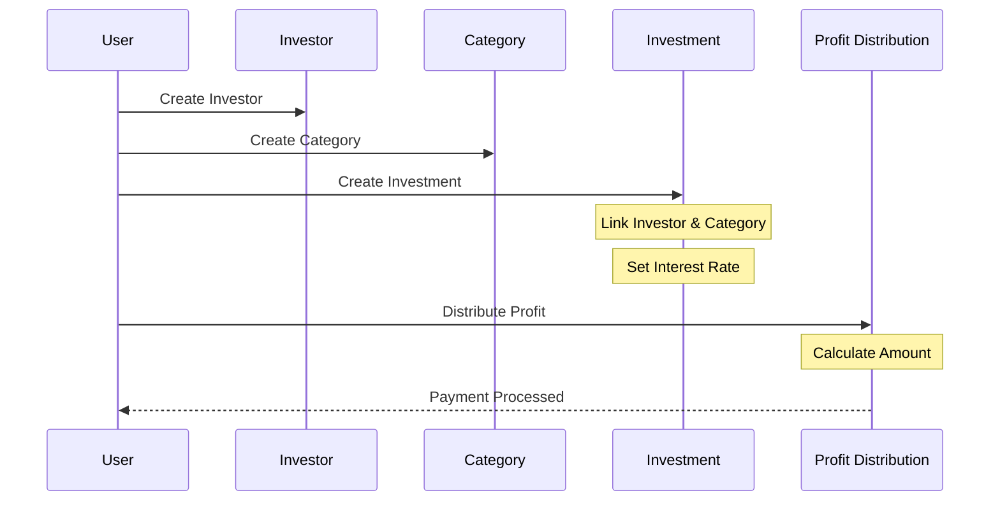
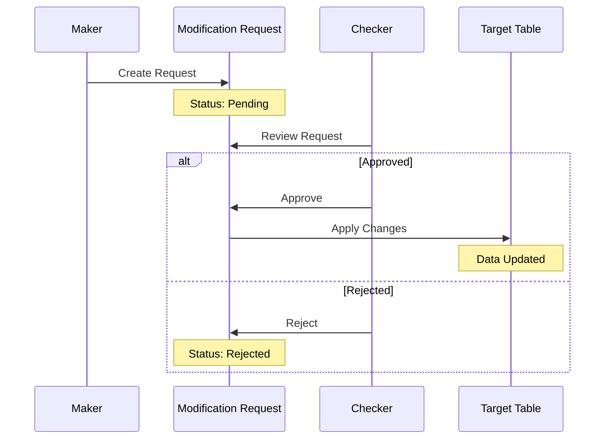

# Database Structure Diagram

This document provides visual representations of the database structure.

## Entity Relationship Diagram



## Table Groups

### Core Banking Module


### IPO Management Module


### Investor Management Module


### Workflow & Audit Module


### Customer Services Module


## Database Schema Overview

```
┌─────────────────────────────────────────────────────────────┐
│                    FinTech Database                         │
├─────────────────────────────────────────────────────────────┤
│                                                             │
│  ┌──────────────┐  ┌──────────────┐  ┌──────────────┐     │
│  │ Core Banking │  │ IPO Module   │  │ Investor Mgmt│     │
│  ├──────────────┤  ├──────────────┤  ├──────────────┤     │
│  │ • users      │  │ • ipo_       │  │ • investors  │     │
│  │ • customers  │  │   listings   │  │ • investor_  │     │
│  │ • accounts   │  │ • ipo_       │  │   categories │     │
│  │ • trans-     │  │   applications│  │ • investments│     │
│  │   actions    │  │              │  │ • profit_    │     │
│  │ • portfolios │  │              │  │   distributions│   │
│  │ • holdings   │  │              │  │ • category_  │     │
│  │              │  │              │  │   account_   │     │
│  │              │  │              │  │   assignments│     │
│  └──────────────┘  └──────────────┘  └──────────────┘     │
│                                                             │
│  ┌──────────────┐  ┌──────────────┐                        │
│  │ Workflow &   │  │ Customer     │                        │
│  │ Audit        │  │ Services     │                        │
│  ├──────────────┤  ├──────────────┤                        │
│  │ • modification│ │ • customer_  │                        │
│  │   _requests  │  │   credentials│                        │
│  │ • activity_  │  │              │                        │
│  │   logs       │  │              │                        │
│  └──────────────┘  └──────────────┘                        │
│                                                             │
└─────────────────────────────────────────────────────────────┘
```

## Data Flow Diagrams

### Customer Onboarding Flow


### Transaction Flow


### Investment Flow


### Maker-Checker Workflow


## Index Strategy

### High-Priority Indexes (Already Implemented)
- **users**: email, staff_id
- **customers**: email
- **accounts**: customer_id
- **transactions**: account_id
- **portfolios**: customer_id
- **holdings**: portfolio_id
- **investors**: email, investor_id
- **investments**: investor_id, category_id
- **activity_logs**: user_id, created_at

### Composite Indexes (Consider for Performance)
```sql
-- For frequent queries
CREATE INDEX idx_transactions_account_date ON transactions(account_id, created_at DESC);
CREATE INDEX idx_investments_investor_status ON investments(investor_id, status);
CREATE INDEX idx_ipo_applications_customer_status ON ipo_applications(customer_id, status);
```

## Storage Estimates

Based on average row sizes:

| Table | Avg Row Size | 10K Rows | 100K Rows | 1M Rows |
|-------|--------------|----------|-----------|---------|
| users | ~500 bytes | 5 MB | 50 MB | 500 MB |
| customers | ~600 bytes | 6 MB | 60 MB | 600 MB |
| accounts | ~300 bytes | 3 MB | 30 MB | 300 MB |
| transactions | ~400 bytes | 4 MB | 40 MB | 400 MB |
| holdings | ~350 bytes | 3.5 MB | 35 MB | 350 MB |
| investors | ~550 bytes | 5.5 MB | 55 MB | 550 MB |
| investments | ~450 bytes | 4.5 MB | 45 MB | 450 MB |

**Note:** These are estimates. Actual sizes will vary based on data content.

---

*This diagram is auto-generated from the database schema. Last updated: 2026-01-12*
